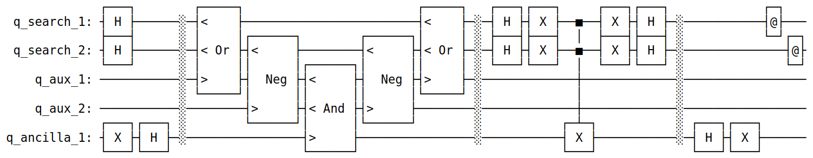

# SymbolicQuantumSimulator 

This is the final semestral project for the course **Julia for Optimization and Learning** (B0B36JUL), winter semester 2024/25.

The author of this project is Vít Břichňáč ([vit.brichnac@cvut.cz](mailto:vit.brichnac@cvut.cz)).

## Project goals

The main objectives of this project were to:

- create a basic set of quantum gates and utilize them in simple quantum circuits
- implement circuit visualization
- implement a simulator to run the circuits

## Motivation

- Julia has several packages for quantum computation, such as [Yao.jl](https://yaoquantum.org/), [Braket.jl](https://forem.julialang.org/kshyatt/introducing-braketjl-10f2) or [QuantumToolbox.jl](https://qutip.org/QuantumToolbox.jl/stable/)
- Those packages use floating-point representations of quantum states, which is commonly used due to its efficiency
- However, it can sometimes be beneficial to perform quantum computations symbolically (mainly for education/demonstration purposes)
- The only package for symbolic quantum computations that I found is [QuantumSymbolics.jl](https://github.com/QuantumSavory/QuantumSymbolics.jl), which can simulate quantum circuits, but it cannot visualize them

## Usage

All functionalities of the package revolve around methods for the `QuantumCircuit` type. Example usage of simple quanqum circuits can be found in the `examples` directory.

